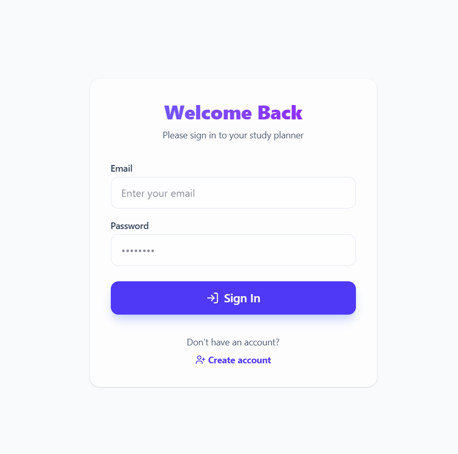
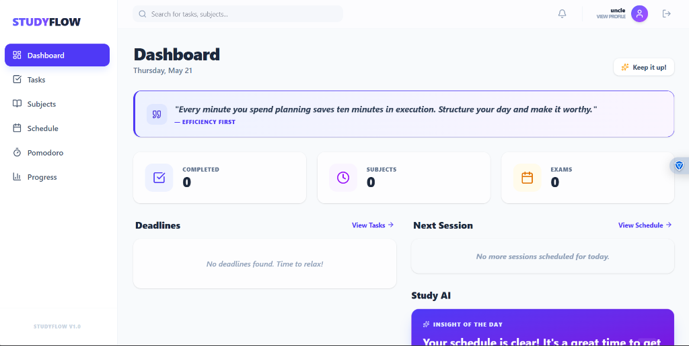
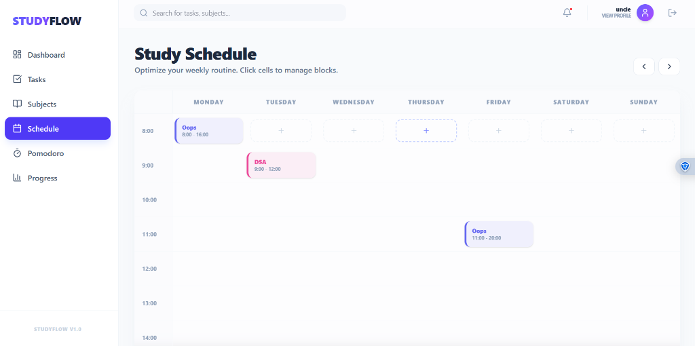
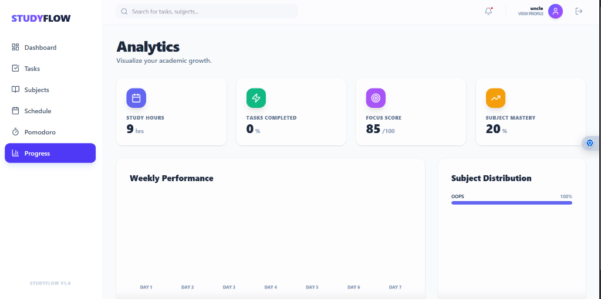
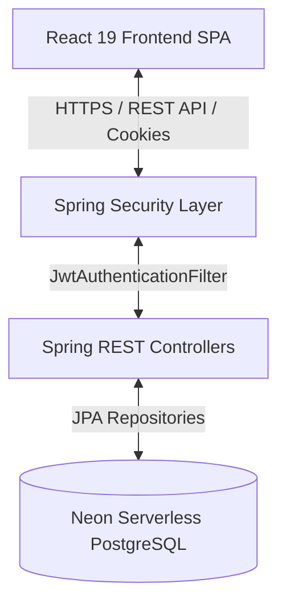

# StudyFlow | Student Study Planner

[](https://opensource.org/licenses/MIT)
[](https://react.dev/)
[](https://spring.io/projects/spring-boot)
[](https://www.postgresql.org/)
[](https://vercel.com)

An enterprise-grade, full-stack academic productivity ecosystem and study scheduler. StudyFlow empowers students to optimize their learning schedules, manage deadlines, utilize scientifically-backed deep focus sessions, and track their academic progression through comprehensive visual analytics. Built on a modern decoupled architecture with React 19 on the frontend and Java 21 / Spring Boot on the backend, StudyFlow delivers security, responsiveness, and clean software engineering.

---

## Table of Contents

1. [Project Overview](#project-overview)
2. [Live Demos](#live-demos)
3. [Tech Stack](#tech-stack)
4. [Core Features](#core-features)
5. [Screenshots](#screenshots)
6. [System Architecture](#system-architecture)
7. [Folder Structure](#folder-structure)
8. [Installation & Local Setup](#installation--local-setup)
9. [Environment Variables](#environment-variables)
10. [Authentication Flow](#authentication-flow)
11. [API Reference](#api-reference)
12. [Deployment Architecture](#deployment-architecture)
13. [Future Enhancements](#future-enhancements)
14. [Contributing](#contributing)
15. [License](#license)

---

## Project Overview

StudyFlow is designed to bridge the gap between task lists and calendar block scheduling. Instead of managing tasks and calendars in silos, the platform provides a unified workspace. By coupling task deadlines with active time-blocking, customizable subject priorities, and a Pomodoro-based focus tracker, it implements modern cognitive science and time management practices (such as the Eisenhower Matrix and Time-Blocking) to maximize retention and prevent academic burnout.

---

## Live Demos

* **Frontend Client (Vercel):** [https://student-study-planner-seven.vercel.app](https://student-study-planner-seven.vercel.app)
* **Backend API (Render):** [https://student-study-planner-backend.onrender.com](https://student-study-planner-backend.onrender.com)

---

## Tech Stack

### Frontend
| Technology | Version | Purpose |
| :--- | :--- | :--- |
| **React** | 19.2.6 | Component-driven UI rendering and state management |
| **Vite** | 8.0.12 | Ultra-fast build tool and development server |
| **Tailwind CSS** | 4.3.0 | Modern utility-first CSS styling and layout configuration |
| **React Router DOM** | 7.15.1 | Client-side routing, navigation, and layout nesting |
| **Lucide React** | 1.16.0 | Clean, accessible vector icons for the user interface |

### Backend
| Technology | Version | Purpose |
| :--- | :--- | :--- |
| **Java** | 21 | Long Term Support (LTS) object-oriented runtime platform |
| **Spring Boot** | 3.4.3 | Microframework for build, configuration, and API lifecycle |
| **Spring Security** | 3.4.3 | Stateless security configurations and route access authorization |
| **Spring Data JPA** | 3.4.3 | Data mapping & persistence layer with Hibernate |
| **JJWT (Java JWT)** | 0.11.5 | JSON Web Token generation, decoding, and validation |
| **Lombok** | 1.18.x | Automation of constructor, getter, setter, and builder boilerplates |
| **Maven** | 3.x | Build automation, package compiling, and dependency manager |

### Database & Dev Tooling
| Technology | Version / Provider | Purpose |
| :--- | :--- | :--- |
| **PostgreSQL** | 16+ | Object-relational database for storing user, subject, task, and schedule data |
| **Neon Database** | Serverless / AWS | Cloud-hosted PostgreSQL instance with connection pooling |
| **Docker** | Multistage | Containerization blueprint for backend service packaging |

---

## Core Features

* **Secure HttpOnly JWT Session Management:** Employs stateless token authentication stored securely inside `HttpOnly` and `SameSite` cookies to neutralize Cross-Site Scripting (XSS) and Cross-Site Request Forgery (CSRF) vectors.
* **Smart Weekly Time-Blocking Calendar:** Interactive, visual 7-day schedule grid allowing students to block dedicated study sessions for their custom subjects.
* **Unified Task & Subject Boards:** Task tracking equipped with priority flags (Low, Medium, High), task categorizations (Exam, Project, Homework, Revision), and color-coordinated custom subject associations.
* **Integrated Pomodoro Engine:** Scientific 25/5 focus timer that helps prevent fatigue and keeps tracks of deep focus intervals.
* **Analytics & Performance Insights:** Interactive dashboard compiling metrics on completed tasks, cumulative weekly study hours, subject time distribution, and derived academic mastery levels.
* **Dynamic User Customization:** Flexible student profile settings containing editable bios and profile image uploads.

---

## Screenshots

### Login Page


### Main Dashboard


### Study Planner & Scheduler


### Analytics Dashboard


---

## System Architecture

StudyFlow implements a decoupled Client-Server architecture designed to scale independently:



* **Client Layer:** Single Page Application (SPA) built using React 19 and compiled with Vite. Handles stateful routing, authentication context, cookie extraction, and dynamic UI styling.
* **API Controller Layer:** Exposes RESTful endpoints mapped under `/api`. Mapped to controller beans handling CRUD logic for schedules, subjects, tasks, and users.
* **Security & Authentication Layer:** Stateless filter chain intercepting incoming requests, extracting the `auth_token` JWT cookie, decoding claims, setting security contexts, and parsing user IDs into request attributes.
* **Persistence Layer:** Database interface managed via Spring Data JPA. Queries are translated through Hibernate ORM to query the cloud-hosted serverless PostgreSQL cluster.

---

## Folder Structure

```bash
Student-Study-Planner/
├── backend/                              # Spring Boot REST API
│   ├── .mvn/                             # Maven wrapper config
│   ├── src/
│   │   ├── main/
│   │   │   ├── java/com/example/backend/
│   │   │   │   ├── controller/           # REST Endpoints (Auth, Tasks, Subjects, Schedule, Users, Analytics)
│   │   │   │   ├── dto/                  # Data Transfer Objects
│   │   │   │   ├── entity/               # JPA Hibernate Entities (User, Task, Subject, ScheduleBlock)
│   │   │   │   ├── repository/           # Spring Data JPA Repository Interfaces
│   │   │   │   └── security/             # JWT, UserDetails, Custom Filter & Security Configurations
│   │   │   └── resources/
│   │   │       └── application.properties# Main application configuration properties
│   │   └── Dockerfile                    # Containerization instructions
│   └── pom.xml                           # Maven dependencies build definition
├── frontend/                             # React Client
│   ├── src/
│   │   ├── assets/                       # Images & Icons
│   │   ├── components/                   # Shareable layouts (Header, Sidebar, Main Layout)
│   │   ├── context/                      # Global authentication context (AuthContext)
│   │   ├── pages/                        # Routable views (Dashboard, Tasks, Subjects, Schedule, Pomodoro, Progress, Profile)
│   │   ├── App.css                       # Application base styles
│   │   ├── App.jsx                       # Routing setup (React Router 7)
│   │   ├── index.css                     # PostCSS / Tailwind CSS entry file
│   │   ├── main.jsx                      # Client Entry point
│   │   └── apiConfig.js                  # Client API Base Endpoint configuration
│   ├── package.json                      # NPM scripts & dependencies
│   ├── vite.config.js                    # Vite setup with proxy rule
│   └── vercel.json                       # Vercel deployment and URL rewrites configuration
├── old-nextjs-app/                       # Archival code (Next.js server-side baseline)
└── README.md                             # Repository documentation
```

---

## Installation & Local Setup

### Prerequisites
* **Java**: SE Development Kit (JDK) 21 installed.
* **Node.js**: Runtime environment v18+ and `npm` packet manager installed.
* **PostgreSQL**: Running locally on port `5432` (or a remote Neon database instance URL).

### 1. Database Setup
Ensure PostgreSQL is active. Create a database named `studyplanner`:
```sql
CREATE DATABASE studyplanner;
```

### 2. Backend API Setup
Navigate to the `backend` directory, define properties, compile and execute:
```bash
# Move to backend directory
cd backend

# Create application environment configurations if needed, or compile directly
# Build the production jar skipping test phase
./mvnw clean package -DskipTests

# Execute the Spring Boot executable JAR
java -jar target/backend-0.0.1-SNAPSHOT.jar
```
The server will boot by default on port `8080` (accessible at `http://localhost:8080`).

### 3. Frontend Client Setup
Navigate to the `frontend` directory, install packages, and spin up the Vite development server:
```bash
# Move to frontend directory
cd ../frontend

# Install node dependencies
npm install

# Start local server (Runs at http://localhost:5173 with proxy configuration pointing to 8080)
npm run dev
```

---

## Environment Variables

### Frontend (`frontend/.env`)
```env
# Optional override for backend endpoint. If left blank, Vite proxy defaults to localhost:8080
VITE_API_URL=
```

### Backend (`backend/src/main/resources/application.properties` or environment variables)
Ensure the following variables are configured in your operating system or local shell before startup:
```env
# Database Credentials
SPRING_DATASOURCE_URL=jdbc:postgresql://localhost:5432/studyplanner
SPRING_DATASOURCE_USERNAME=postgres
SPRING_DATASOURCE_PASSWORD=your_password

# Authentication Secret
JWT_SECRET=your_base64_encoded_hmac_sha_256_secret_key_at_least_256_bits_long
JWT_EXPIRATION=86400000

# CORS Allowed Client Domains
CORS_ALLOWED_ORIGINS=http://localhost:5173,https://student-study-planner-seven.vercel.app
```

---

## Authentication Flow

StudyFlow protects resources using stateful token containment on top of a stateless session architecture:

```
[Client]                      [API Gateway / Filters]            [Database]
   |                                    |                            |
   |-- 1. POST /api/auth/login -------->|                            |
   |                                    |-- 2. Verify Credentials -->|
   |                                    |<-- 3. User Entity --------|
   |                                    |                            |
   |                                    |-- 4. Generate JWT --------|
   |<-- 5. Set Cookie (auth_token) -----|                            |
   |                                    |                            |
   |-- 6. GET /api/tasks (With Cookie)->|                            |
   |                                    |-- 7. Validate Cookie/JWT ->|
   |                                    |-- 8. Extract User ID ------>|
   |<-- 9. HTTP 200 (Tasks JSON) -------|                            |
```

1. **Authentication request:** The user enters credentials on the `/login` or `/signup` screens.
2. **Token Generation:** The API validates the user, generates a JWT using `JwtUtil`, and creates a response cookie:
   * **Name:** `auth_token`
   * **Attributes:** `HttpOnly`, `Path=/`, `MaxAge=7 Days`, `Secure` (in production)
3. **Filter Interception:** When the client performs subsequent data requests, `JwtAuthenticationFilter` intercepts the query, parses the cookie list, and extracts `auth_token`.
4. **Context Loading:** The filter validates the claims. On success, it fetches user authorities from `CustomUserDetailsService` and commits the authentication object into the `SecurityContextHolder`. It also sets the `userId` in request attributes so controllers can query items relative to that user context.

---

## API Reference

All requests to non-public endpoints require the `auth_token` cookie.

### Authentication Endpoints
| Endpoint | Method | Access | Description |
| :--- | :--- | :--- | :--- |
| `/api/auth/signup` | `POST` | Public | Register new student profile and set session cookie |
| `/api/auth/login` | `POST` | Public | Validate student credentials and inject session cookie |
| `/api/auth/me` | `GET` | Private | Retrieve active student profile summary |
| `/api/auth/logout` | `POST` | Private | Expire the session cookie |

### Task Endpoints
| Endpoint | Method | Access | Description |
| :--- | :--- | :--- | :--- |
| `/api/tasks` | `GET` | Private | Fetch all tasks created by the authorized user |
| `/api/tasks` | `POST` | Private | Create a new study task |
| `/api/tasks/{id}` | `PUT` | Private | Modify parameters or toggle completion state of a task |
| `/api/tasks/{id}` | `DELETE` | Private | Permanently delete a task |

### Subject Endpoints
| Endpoint | Method | Access | Description |
| :--- | :--- | :--- | :--- |
| `/api/subjects` | `GET` | Private | Fetch all customized user subjects |
| `/api/subjects` | `POST` | Private | Create a new subject with name and color hex |
| `/api/subjects/{id}` | `PUT` | Private | Update subject metadata |
| `/api/subjects/{id}` | `DELETE` | Private | Remove a custom subject |

### Schedule & Calendar Endpoints
| Endpoint | Method | Access | Description |
| :--- | :--- | :--- | :--- |
| `/api/calendar` | `GET` | Private | Retrieve weekly scheduled study blocks |
| `/api/calendar` | `POST` | Private | Add an active time-blocked study session |
| `/api/calendar/{id}` | `DELETE` | Private | Clear a specific time-block from the calendar |

### User Profile Endpoints
| Endpoint | Method | Access | Description |
| :--- | :--- | :--- | :--- |
| `/api/users/profile` | `GET` | Private | Fetch detailed profile including bio and profile picture |
| `/api/users/profile` | `PUT` | Private | Update profile name, bio, and profile picture |

### Analytics Endpoints
| Endpoint | Method | Access | Description |
| :--- | :--- | :--- | :--- |
| `/api/analytics/stats` | `GET` | Private | Retrieve general stats (Study hours, Completion rate, Focus score) |
| `/api/analytics/weekly` | `GET` | Private | Fetch daily study productivity numbers for the week |
| `/api/analytics/distribution` | `GET` | Private | Retrieve percentage breakdown of time spent per subject |

---

## Deployment Architecture

### 1. Frontend Client (Vercel)
The React SPA is deployed on Vercel. Static assets are distributed globally via edge network caching. Client-side navigation fallback rules and API proxies are configured inside the `vercel.json` file:
```json
{
  "cleanUrls": true,
  "rewrites": [
    {
      "source": "/api/:path*",
      "destination": "https://student-study-planner-backend.onrender.com/api/:path*"
    },
    {
      "source": "/:path*",
      "destination": "/index.html"
    }
  ]
}
```

### 2. Backend API (Render)
The Spring Boot web service is deployed to Render using a multi-stage Docker build pattern matching the repository's [Dockerfile](backend/Dockerfile). It spins up a Linux container environment, runs maven packaging, and launches the compiled JAR on port `8080`.

### 3. PostgreSQL Database (Neon)
The persistence layer relies on Neon PostgreSQL database cluster hosted on AWS, which utilizes autoscaling compute and serverless storage virtualization to minimize memory overhead while keeping query executions fast.

---

## Future Enhancements

* **Third-Party Calendar Integration:** Integration with Google Calendar, Outlook, and Apple Calendar via iCal format links.
* **OAuth2 Authentication Providers:** Google, Microsoft, and GitHub single sign-on (SSO) integration.
* **Real-time Reminders & Notifications:** PWA implementation with Web Push notifications and Firebase Cloud Messaging for deadline reminders.
* **WebSocket Collaboration Spaces:** Shared study rooms letting students plan schedule blocks and pomodoro focus runs together.
* **AI Study Optimizer:** An intelligent assistant predicting deadline bottlenecks and suggesting optimized study windows based on completion metrics.

---

## Contributing

1. Fork the Project Repository.
2. Create your Feature Branch: `git checkout -b feature/AmazingFeature`.
3. Commit your Changes: `git commit -m 'Add some AmazingFeature'`.
4. Push to the Branch: `git push origin feature/AmazingFeature`.
5. Open a Pull Request.

---

## License

Distributed under the MIT License. See [LICENSE](LICENSE) for more information.

---

**StudyFlow** — Streamlining academic workflow, one study block at a time.
